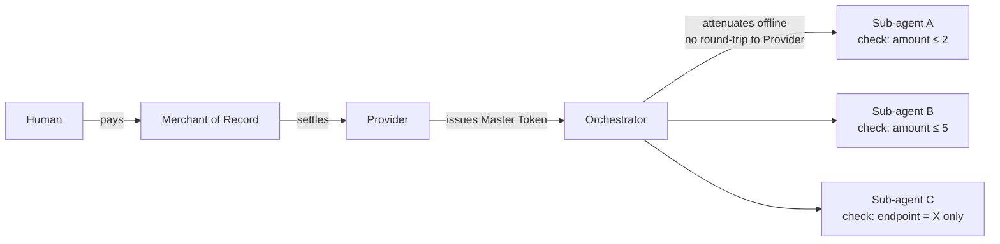
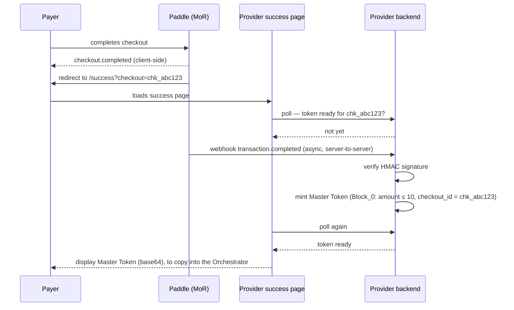

# Architecture (draft)

## Actors

- **MoR (Merchant of Record)**: processes the single upfront payment, handles tax/compliance, settles funds to the Provider. Not part of the M2M protocol itself.
- **Provider**: the entity exposing one or more M2M services. Holds the private signing keypair. Runs the verifying endpoint(s), which only ever need the corresponding public key.
- **Orchestrator**: the client-side agent that pays (via the human it acts for, through the MoR) and receives the Master Token.
- **Sub-agents**: autonomous agents spawned/directed by the Orchestrator, each receiving an attenuated token covering only their slice of the budget.

## Cryptographic primitive: Biscuit tokens

A Provider exposing multiple M2M endpoints under one budget needs every verifying endpoint to be able to check the same token lineage.
This whitepaper uses **Biscuit tokens**, a macaroon-like scheme built on public-key signatures instead of HMAC chains, specifically because of this requirement.

With a classic HMAC-chained macaroon, verifying a token from scratch requires the same secret root key used to issue it: every verifying endpoint would need to hold that secret, and compromise at any single endpoint would allow forging valid tokens everywhere else.
With Biscuit, the Provider signs the root block with a private key, and every verifying endpoint only needs the corresponding **public** key to validate the full chain.
Offline attenuation still works exactly as it does with macaroons: the Orchestrator (and sub-agents, transitively) can append new signed blocks that only narrow the authorization, without ever holding the Provider's private key.

For context: L402 uses classic HMAC-based macaroons, inherited from `lnd`'s pre-existing RPC authentication mechanism rather than chosen after evaluating alternatives. Biscuit was still immature at the time L402 was designed.
The original 2014 macaroon design (Google) chose HMAC deliberately for a single-organization, internal trust domain, where the lower computational cost of HMAC mattered at scale and safe key distribution within one's own infrastructure wasn't a hard problem.
This whitepaper's scenario (one provider, potentially several independently-run service endpoints, minimizing blast radius) sits closer to a multi-party trust model, which is why public-key verification is the better fit here.

Here a brief scheme of how a Biscuit chain is composed and, optionally, sealed (impossible to add new blocks after that).

### 1. The Core Principle: Ephemeral Keys

The cryptographic "magic" of Biscuit does not reside in a single global signature (like JWTs), but in a **certification chain internal to the token** based on the continuous generation of ephemeral keys.

Every block not only guarantees its own integrity but also **certifies the validity of the subsequent block**. To do this, anyone adding a block to the token generates a **new ephemeral cryptographic key pair** (one public and one private).

> The core idea is: The signer of a block includes in their signature not just the block's data, but also the key pair that must be used to both sign and verify the next block.

This creates an unbroken chain of cryptographic trust.

### 2. Token Creation (The Authority Block)

When the Provider, which holds the root key pair ($SK_{root}$ and $PK_{root}$), wants to generate a **Master Token**:

1. **Provider creates Block 0 (Authority Block)**: This block contains the settled budget (e.g., `amount <= 10`), and an identifier correlating it to the underlying payment (e.g., `checkout_id = chk_abc123`). This identifier is what lets the Provider look up the right budget ledger entry on every subsequent call, and the right record to invalidate on revocation (see §6-7 below).
2. **Generate ephemeral keys**: The server generates a new key pair on the fly: $SK_1$ (Private) and $PK_1$ (Public).
3. **The Signature**: The server signs a mathematical concatenation composed of Block 0's content and the new public key $PK_1$, using its root private key:

$$Sig_0 = \text{Sign}(SK_{root}, Block_0 \parallel PK_1)$$

4. **Token Composition**: The token delivered to the Orchestrator contains:
* **Blocks**: `[Block_0]`
* **Public Keys**: `[PK_1]`
* **Signatures**: `[Sig_0]`
* **Active Private Key**: $SK_1$

*It is the possession of this current ephemeral private key ($SK_1$) that allows the token holder to attenuate it offline without contacting the server.*

### 3. Attenuation (Extending the Chain)

Now the Orchestrator wants to pass this token to a sub-agent but wishes to attenuate it so that it can only spend up to a certain sub-budget (add a check: `amount <= 3`).
Restriction types this whitepaper considers:

- `amount <= N`: hard ceiling on spend, in the budget's currency
- `quota <= N`: hard ceiling on number of calls, independent of amount
- `endpoint = <service>`: restricts which service(s) the sub-agent can call
- `expires_at <= T`: time-bound validity
- `sub_agent_id = <id>`: for attribution/auditing

Whether a given Provider actually enforces each of these is not guaranteed by the token format itself — see `supported_checks` in the wire protocol section below.

The Orchestrator performs attenuation completely offline:

1. **Creates Block 1**: Writes the new restrictive rules.
2. **Generates new keys**: Creates a new ephemeral key pair: $SK_2$ and $PK_2$.
3. **The Signature**: Signs Block 1 and the new public key $PK_2$, but this time **it uses the ephemeral private key from the previous block** ($SK_1$) found within the token:

$$Sig_1 = \text{Sign}(SK_1, Block_1 \parallel PK_2)$$

4. **Token Update**: The new resulting token contains:
* **Blocks**: `[Block_0, Block_1]`
* **Public Keys**: `[PK_1, PK_2]`
* **Signatures**: `[Sig_0, Sig_1]`
* **Active Private Key**: $SK_2$ (the previous one, $SK_1$, is discarded).

This process can be repeated. Every new block $N$ signs $Block_N \parallel PK_{N+1}$ using $SK_N$.

It is also possible, and it is the actual suggestion of this whitepaper, to generate multiple chains starting from the same **Master Token**, one for each sub-agent requiring a sub-budget.
Of course, an Orchestrator could generate many perfectly valid chains but surpassing the original budget summing all of them.
Cryptography alone cannot prevent this. Every one of those chains is a perfectly valid Biscuit, since attenuation only ever narrows what a single chain authorizes, it says nothing about how many sibling chains exist.
This is why the Provider **must** track and enforce budget consumption itself, call by call, across every chain derived from the same Master Token (see §6 below).

### 4. Token Sealing (Sealing)

As long as the token contains the active private key $SK_N$, anyone who intercepts it could add further blocks. While attenuation only allows *reducing* permissions, it might still be undesirable to allow further modification.

If the Orchestrator, or a sub-agent, want to make it impossible to continue the chain, it can **seal the token**.

Sealing simply involves **deleting the last ephemeral private key ($SK_N$) from the token payload**. Without that key, the chain is cryptographically broken from a modification perspective: it is mathematically impossible to append and sign a new block.

### 5. Chain Verification (Provider side)

The cryptographic verification process examines the chain sequentially, and only requires the $PK_{root}$ key to start:

1. **Check Block 0**: The server extracts $Block_0$ and $PK_1$, and verifies that $Sig_0$ was generated by the trusted $PK_{root}$ key. If the signature is valid, the server "trusts" Block 0 and, crucially, **starts trusting key $PK_1$** for the next step.
2. **Check Block 1**: The server extracts $Block_1$ and $PK_2$, and verifies that $Sig_1$ is valid relative to key $PK_1$ (the authenticity of which it just confirmed). If it passes, it trusts Block 1 and $PK_2$.
3. Repeat until the last block.

If all signatures in the chain are mathematically correct, the payload has not been tampered with. At that point, the server starts the logic engine to perform the actual validation of rights (checking if the facts from Block 0 satisfy the various checks in subsequent attenuation blocks and the server's own policies).

### 6. Budget tracking

Because attenuation is purely additive (§3) and multiple sibling chains can be derived from the same Master Token, the cryptography by itself cannot guarantee that the sum of everything actually spent across a swarm of sub-agents stays within the original budget.
The Provider **must** maintain that guarantee itself, as server-side state:

- **Ledger key**: the identifier embedded in Block 0 at issuance (§2), e.g. `checkout_id`, is what ties every call, from every chain derived from the same Master Token, back to a single budget record.
- **Concurrency**: sub-agents can call concurrently. The exact mechanism is an implementation detail out of scope for this whitepaper, but the atomicity requirement itself is not optional.
- **What's tracked depends on the attenuation model chosen upstream (§3):** a fixed partition (non-overlapping sub-budgets decided once, at attenuation time) only needs a per-request ceiling check, no shared counter.
A shared running counter (sub-agents drawing from a common pool, checked against a cumulative total) needs the stateful ledger described above.
Both are legitimate choices depending on the Orchestrator's use case, what the Provider must do is support whichever ones it claims to, and say so.
This is why the wire protocol (see below) includes a `supported_budget_models` field: an Orchestrator has no way to safely choose between the two without knowing which the Provider's ledger actually enforces.
Also, a Provider might support the shared-counter model but only for amount, and not maintain any state for quota. The two are independent capabilities, and both need to be advertised separately.

### 7. Revocation

Trigger: MoR reports a dispute or refund on the transaction backing a **Master Token**.

The Provider **must** keep track of the budget consumption during each sub-agents call (§6), because a valid Biscuit doesn't mean that the paid budget is not already terminated — the same ledger entry used for §6 is what the Provider marks as invalid once the MoR reports a dispute or refund, looked up via the same identifier embedded in Block 0.

**Problem**: using a prepaid budget that could be subject to a refund means that the sub-agents could access the resources before the refund is processed (effectively for free).
Possible mitigation ideas:

1. Reduce the budget sold through the MoR.
2. Strictly verify the MoR refund policies and apply rate limits, if applicable.
3. Introduce a client identification to avoid multiple refunds from the same origin (out of scope).

## Endpoint & wire protocol: reusing X402

**Design intent:** stay as close as possible to X402 (v2), rather than inventing a parallel wire format.
X402 is the closest thing to an emerging standard in this space, has meaningful institutional backing (Coinbase, Cloudflare, the X402 Foundation under the Linux Foundation), and reusing its envelope means anything built here can, in principle, sit behind the same middleware/tooling ecosystem already growing around it.
Where this whitepaper diverges from X402, the divergence is called out explicitly as an extension, not folded in silently as if it were already part of the spec.

### Headers reused as-is

X402 v2 defines three headers, all reused here with their existing names and encoding (base64 JSON):

- `PAYMENT-REQUIRED` — server → client, carries `PaymentRequirements`.
- `PAYMENT-SIGNATURE` — client → server, carries a `PaymentPayload`.
- `PAYMENT-RESPONSE` — server → client, carries a `SettlementResponse`.

### Where this whitepaper matches X402's model

| | X402 (crypto) | This whitepaper (MoR) |
|---|---|---|
| `PAYMENT-REQUIRED` triggers on missing/invalid payment proof | ✅ | ✅ |
| `PaymentRequirements` describes how to pay, pluggable by `scheme` | ✅ (`exact`, `deferred`, ...) | ✅ (new `scheme`, see below) |
| `PAYMENT-SIGNATURE` carries proof of authorization on each call | ✅ (signed crypto payload) | ✅ (attenuated Biscuit token) |
| Server-side verification is what ultimately grants access | ✅ | ✅ |

### Where it diverges, and why

**A new `scheme`: `mor-fiat`.** `PaymentRequirements` already supports multiple schemes to describe different payment methods.
This whitepaper adds one (`mor-fiat`) whose payload describes a MoR checkout (checkout URL, amount, currency) instead of an on-chain address and network.
This is not part of the official X402 spec; it follows the spec's own extension model (schemes are meant to be pluggable), but it should be read as a proposal, not as an existing standard scheme.

The `mor-fiat` scheme also carries a `supported_budget_models` field (e.g. `["fixed-partition", "shared-counter"]`) advertising which of the two budget-tracking models described in Budget tracking above this particular endpoint actually enforces.
An Orchestrator reads this before attenuating, so it never assumes a guarantee (like unused-budget rollover under a shared counter) that this Provider doesn't actually back with server-side state.
Similarly, the scheme should also carry a `supported_checks` field (e.g. `["amount", "quota", "endpoint", "expires_at"]`). In this way the Orchestrator can know which attenuation checks the Provider is supporting.

**MoR Token provisioning is out of scope.** It's the Provider who chooses which MoR to integrate, and consequently what mechanism (if any) is available to get a token to a client, not something the client or the protocol negotiates.
Different MoRs will naturally lend themselves to different delivery mechanisms (webhook, polling, redirect callback, manual retrieval...), and different client-side systems may have different constraints or preferences for consuming whichever one the Provider offers, but that's the Provider's integration choice, informed by its own MoR and its own client base, and too variable to standardize here.

What actually matters for this whitepaper is narrower: **the Provider needs to be able to correlate a given token with a specific completed payment, for a specific budget**.
That's the only fact the issuance step (Token Creation, above) depends on. Everything about *how* that correlation is established, and how that token reach the Orchestrator, is out of scope.
From the Orchestrator's point of view, there are exactly two situations:

- **Token already available.** It was provisioned before the first call (e.g. the payer bought the budget ahead of time, some external process dropped the token into the Orchestrator's local store). The Orchestrator simply has it and proceeds, the `402` round-trip below never triggers.
- **Token not yet available.** The Orchestrator calls a service, gets `402 PAYMENT-REQUIRED`, has no token to satisfy it. It surfaces the requirement to whoever it acts for (the human, or an upstream system), and retries with backoff until a token becomes available, however the Provider's chosen mechanism makes that happen. The retry loop belongs to the Orchestrator, the provisioning mechanism behind it doesn't.

Both webhook-based and polling-based provisioning (or any other mechanism) are valid Provider-side implementation choices. This whitepaper does not mandate one.

### A concrete example: Paddle

Webhooks are the de facto standard across MoRs for notifying a seller that a payment happened, Paddle's `transaction.completed` event (HMAC-signed, delivered server-to-server) is structurally the same pattern used by Stripe and many other providers in this space, which makes it a reasonable concrete example rather than a Paddle-specific assumption.

One timing detail is worth calling out explicitly, because it's exactly the "token not yet available" case above, made concrete: Paddle's checkout redirects the payer to a success page immediately client-side, but the authoritative server-to-server webhook can arrive a few seconds later.
A success page built naively, assuming the token is already there the moment it loads, will fail silently on every purchase, not just occasionally.

This is the base case this whitepaper targets: no custom integration between the Provider and Paddle beyond a standard webhook handler, and the "asset" a generic MoR checkout is already built to display on its success page is the Master Token itself.

**If token delivery happens over this same wire protocol, `PAYMENT-RESPONSE` shouldn't carry it.** `PAYMENT-RESPONSE` confirms that a settlement happened; the Master Token is a distinct, long-lived bearer credential.
Conflating the two in one header would be a modeling mistake even if convenient. A separate header (working name `AGENT-BUDGET-TOKEN`) keeps them apart.

**`PAYMENT-SIGNATURE` is reinterpreted for sub-agent calls, not just reused.** When a sub-agent calls a service with its attenuated Biscuit token, putting that token in `PAYMENT-SIGNATURE` is a natural fit semantically, from the service's point of view, a valid attenuated token *is* proof of authorization, exactly what `PAYMENT-SIGNATURE` is for.
But it is a reinterpretation: X402 expects a payload authorizing *this specific payment*, not a longer-lived bearer credential presented across many calls.
