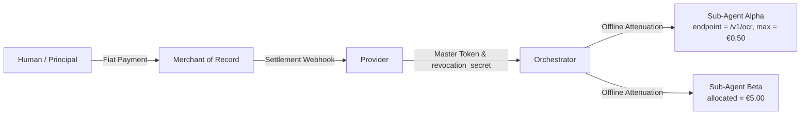
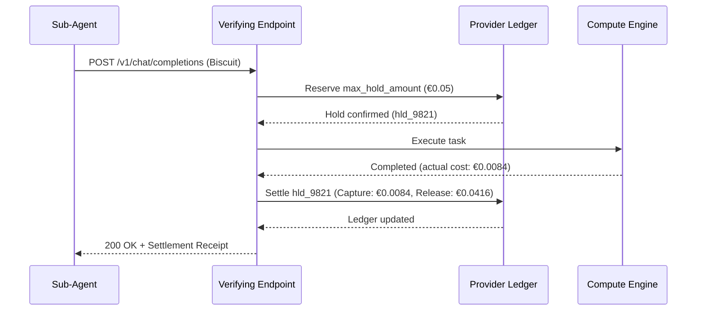
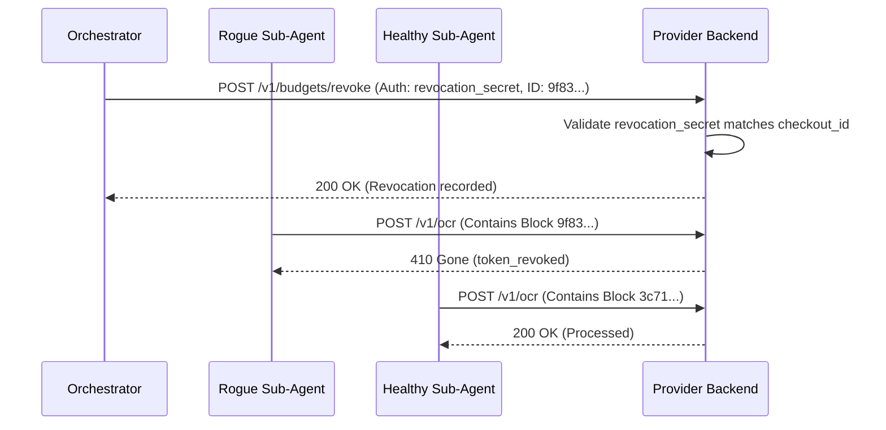

# Architecture: Cryptographic Delegation & Budget Accounting

## 1. Actors

- **Merchant of Record (MoR)**: Processes the upfront fiat payment, manages tax and indirect VAT/sales compliance, and settles funds to the Provider. The MoR operates outside the M2M protocol itself.
- **Provider**: Exposes one or more M2M services. Holds and manages the private root signing key ($SK_{root}$) and distributes its corresponding public key ($PK_{root}$) to verifying endpoints (resource servers/gateways).
- **Orchestrator**: Client-side coordinator agent. It may trigger or surface an initial 402 Payment Required challenge to the human user. Once the human user completes the fiat payment with the MoR, the Orchestrator receives the provisioned Master Token (for spending and offline attenuation) alongside a high-entropy management credential (`revocation_secret`) for administrative operations. It attenuates the Master Token offline into restricted sub-budgets and distributes them to downstream worker agents without sharing the management secret.
- **Sub-Agents**: Autonomous worker agents spawned by the Orchestrator, each receiving an attenuated, sealed token restricting execution scope and spend.



## 2. Cryptographic Primitive: Biscuit Tokens

Verifying endpoints across a distributed or multi-service architecture must validate access credentials without circular dependencies on a central issuing key. This architecture adopts **[Biscuit tokens](https://www.biscuitsec.org/)**, a decentralized authorization scheme based on public-key signatures and Datalog policies.

### 2.1 Contrast with HMAC Macaroons
Classic [Macaroons](https://doi.org/10.14722/ndss.2014.23212) (as deployed in [L402](https://github.com/lightninglabs/L402)) rely on symmetric HMAC chains. In L402 (formerly LSAT), this design aligns naturally with its Lightning Network origins: token issuance is intrinsically bound to a cryptographic payment hash and its preimage (proof-of-payment), typically verified directly by the single node or monolithic gateway that minted the token. In such single-service or small-scale topologies, maintaining a symmetric root secret locally incurs minimal architectural penalty while offering fast, lightweight HMAC-SHA256 operations.

However, when scaling capability delegation across a distributed multi-service architecture or a multi-provider consortium, symmetric HMAC chains become a critical limitation: verifying a token requires knowledge of the root secret key. Consequently, every verifying endpoint within a provider's infrastructure must either hold the root secret—greatly expanding the compromise blast radius—or synchronously query the issuing service on every request, creating an operational bottleneck.

In contrast, Biscuit uses asymmetric public-key cryptography. The Provider signs the root block with a private key ($SK_{root}$), and verifying endpoints (resource servers/gateways) validate the delegation chain using only the public key ($PK_{root}$). Offline attenuation remains cryptographically guaranteed: downstream holders (clients and orchestrators) can append restrictive blocks without knowledge of the private signing keys and without needing to configure or manage public key registries.

### 2.2 Ephemeral Key Chains
Biscuit chains blocks via internal ephemeral keypairs:
- When a block $i$ is appended, the signer generates a new ephemeral keypair ($SK_{i+1}, PK_{i+1}$).
- The signer computes signature $Sig_i$ over the concatenation of the block payload and the new public key $PK_{i+1}$, using the private key $SK_i$ from the preceding block:

$$Sig_i = \text{Sign}(SK_i, Block_i \parallel PK_{i+1})$$

The signature verifies both the integrity of $Block_i$ and the authenticity of $PK_{i+1}$, establishing a cryptographic chain of custody.

### 2.3 Master Token Issuance (The Authority Block)
Upon receiving a confirmed payment from the MoR, the Provider generates the Master Token and associated management credentials:
1. **Block 0 (Authority Block)**: Contains the base entitlement and financial correlation identifier (e.g., `checkout_id = "chk_883019"`).
2. **Key Generation**: Provider generates ephemeral keypair ($SK_1, PK_1$).
3. **Signature**: Provider signs $Block_0 \parallel PK_1$ using $SK_{root}$:

$$Sig_0 = \text{Sign}(SK_{root}, Block_0 \parallel PK_1)$$

4. **Payload Delivery**: Delivered to the Orchestrator containing `[Block_0]`, `[PK_1]`, `[Sig_0]`, and active private key $SK_1$. Possession of $SK_1$ authorizes offline attenuation.
5. **Management Secret Generation**: Concurrently, the Provider generates a high-entropy management credential (`revocation_secret`, such as a 256-bit random bearer secret) and stores its hash alongside `checkout_id` in the stateful ledger. This credential is delivered exclusively to the Orchestrator to isolate administrative capabilities (surgical revocation) from operational spending tokens.

## 3. Attenuation & Datalog Semantics

The Orchestrator derives specialized tokens for downstream sub-agents by appending signed attenuation blocks.

### 3.1 Datalog Execution Model: Stateless Checks vs. Stateful Budgets
Biscuit policies are expressed in [Datalog](https://doi.org/10.1109/69.43410) (Ceri et al., 1989). A `check` evaluates facts carried within the token blocks alongside **ambient facts** injected dynamically by the verifying endpoint for that specific request (e.g., `ambient::request_cost(0.05)`, `ambient::endpoint("/v1/ocr")`).

The Datalog engine operates deterministically and without persistent state across requests. Authorization constraints fall into two distinct operational classes:

#### 1. Stateless Per-Request Caveats (Local Evaluation)
Enforced entirely by the local Datalog engine without database interaction:
- Per-invocation cost ceiling:
  ```datalog
  check if ambient::request_cost($c), $c <= 0.50;
  ```
- Endpoint restriction:
  ```datalog
  check if ambient::endpoint($e), $e == "/v1/ocr";
  ```
- Temporal expiration:
  ```datalog
  check if ambient::time($t), $t <= 1774224000;
  ```

#### 2. Stateful Cumulative Quotas (Ledger Correlation)
A caveat such as `check if ambient::request_cost($c), $c <= 3.00` validates only that the *individual* request does not exceed €3.00. It does not enforce a cumulative ceiling across multiple calls.

To enforce cumulative sub-budgets across an agent swarm:
1. The Orchestrator embeds an identity fact in the attenuation block:
   ```datalog
   fact: sub_agent_id("worker-alpha");
   fact: allocated_budget(3.00);
   ```
2. The verifying endpoint extracts `sub_agent_id` from the verified token and queries the central ledger (which in this architecture is simply a standard local datastore, such as a PostgreSQL or Redis database) for the composite key `(checkout_id, sub_agent_id)`.
3. The server ensures that cumulative historical spend plus current request cost does not exceed `allocated_budget`.

## 4. Token Sealing & Proof of Possession

### 4.1 Mandatory Sealing
An unsealed Biscuit contains the active ephemeral private key $SK_N$, permitting further block additions. Before delegating a token to an untrusted or sandboxed sub-agent, the Orchestrator **seals** the token by stripping $SK_N$. Without $SK_N$, appending further blocks is mathematically impossible, while verification remains intact.

### 4.2 Proof of Possession (PoP)
By default, sealed Biscuits are bearer credentials: possession of the token string allows spending from the associated ledger account. In environments with untrusted intermediaries or tools, the Orchestrator binds the token to the sub-agent's asymmetric keypair ($SK_{sub}, PK_{sub}$) using Proof of Possession principles ([RFC 9449](https://doi.org/10.17487/RFC9449)):
1. **Binding Caveat**: Orchestrator embeds the sub-agent public key:
   ```datalog
   check if ambient::caller_pk($pk), $pk == "hex_encoded_pk_sub";
   ```
2. **Request Signature**: The sub-agent signs request metadata (method, URI, timestamp) with $SK_{sub}$, passed via `extensions.pop_signature`.
3. **Verification**: The endpoint validates the signature and asserts `ambient::caller_pk("hex_encoded_pk_sub")`. Replayed or intercepted tokens fail Datalog evaluation without $SK_{sub}$.

## 5. Chain Verification

Verification proceeds sequentially from $PK_{root}$:
1. Verify $Sig_0$ on $Block_0 \parallel PK_1$ using $PK_{root}$.
2. Verify $Sig_1$ on $Block_1 \parallel PK_2$ using authenticated $PK_1$.
3. Continue to terminal block $N$.
4. Evaluate Datalog caveats against ambient request facts.

## 6. Budget Accounting & Ledger Management

Because attenuation is purely additive, cryptographic verification alone cannot prevent sibling tokens derived from the same root from overdrawing the initial balance. The Provider maintains a stateful ledger (a conventional relational or key-value datastore, such as PostgreSQL, SQLite, or Redis) indexed by `checkout_id`.

### 6.1 Two-Phase Settlement for Dynamic Costs (Hold / Capture)
For variable-cost workloads (such as LLM generation and streaming pipelines), billing post-execution creates overdraft risks, while static pre-billing is inflexible. The Provider ledger implements an atomic two-phase lifecycle:
1. **Hold (Reservation)**: Prior to dispatching compute, the server places a hold on `max_hold_amount` under `checkout_id`. If `available_balance < max_hold_amount`, the request is rejected immediately (`402 Payment Required`, `budget_insufficient_for_reservation`).
2. **Execution & Metering**: The task executes while monitoring consumption against the ceiling.
3. **Capture & Release**: Upon completion, the server commits `actual_cost` and releases the difference (`max_hold_amount - actual_cost`) back to `available_balance`.



### 6.2 Budget Top-Up
When a balance is depleted, re-issuing new tokens disrupts active agent swarms. The Provider ledger treats `checkout_id` as a persistent credit account:
- Upon receiving a top-up checkout webhook from the MoR, the Provider increments `available_balance` on the existing `checkout_id`.
- Active sub-agents resume operations with their existing, sealed Biscuit tokens. No token re-attenuation or swarm redeployment is required.

### 6.3 Architectural Scope: SME Model & Vertical Partitioning
This architecture focuses on freelancers and small-to-medium enterprises (SMEs) with targeted microservice portfolios:
- **Centralized ACID Ledger**: Distributed consensus algorithms (e.g., Raft, Paxos) are deliberate non-goals. A standard relational or in-memory store with row-level locks provides atomic settlement without distributed consensus overhead.
- **Consortium Verification via Vertical Partitioning**: In multi-entity environments, an issuing entity acts as guarantor and signs Block 0. Partner providers verify tokens using the issuer's public key ($PK_{root}$). Quotas are partitioned vertically (e.g., `endpoint = provider2.example, allocated_budget = €2.00`), allowing partner services to track balances in local databases without real-time cross-provider synchronization.

## 7. Revocation Architecture

Revocation operates at two distinct tiers:

### 7.1 Tier 1: Upstream MoR Master Revocation
Triggered by payment refunds, disputes, or chargebacks reported via MoR webhooks. The Provider marks `checkout_id` as revoked in the ledger. All downstream sub-agent requests under that lineage fail ledger resolution (`410 Gone`, `token_revoked`).

### 7.2 Tier 2: Surgical Sub-Agent Revocation
When an individual sub-agent exhibits anomalous behavior (e.g., recursion loops), the Orchestrator can revoke that specific agent without terminating healthy swarm siblings:
1. **Cryptographic Block Identifiers**: Each Biscuit block deterministically derives a `revocation_id` (the SHA-256 hash of the serialized block payload and signature). When appending an attenuation block offline, the Orchestrator extracts and records the resulting `revocation_id` in its local agent registry.
2. **Privilege Separation (Bearer Spending vs. Administrative Revocation)**: To prevent rogue or compromised sub-agents from revoking themselves, their siblings, or the Master Token, revocation requests require administrative authorization. The Orchestrator calls `POST /v1/budgets/revoke`, authenticating with its `revocation_secret` (via `Authorization: Bearer <revocation_secret>`) rather than a standard bearer Biscuit.
3. **Lineage Validation & IDOR Prevention**: The Provider validates that the presented `revocation_secret` matches the designated `checkout_id`. Once authenticated, the target `revocation_id` is appended to the ledger's revoked block registry for that account. This eliminates cross-tenant Denial of Service (IDOR) attacks.
4. **Enforcement**: Verifying endpoints match presented tokens against the revocation cache. Tokens containing the revoked block return `410 Gone`, while sibling chains remain authorized.




