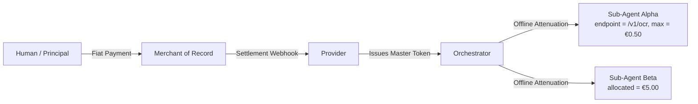
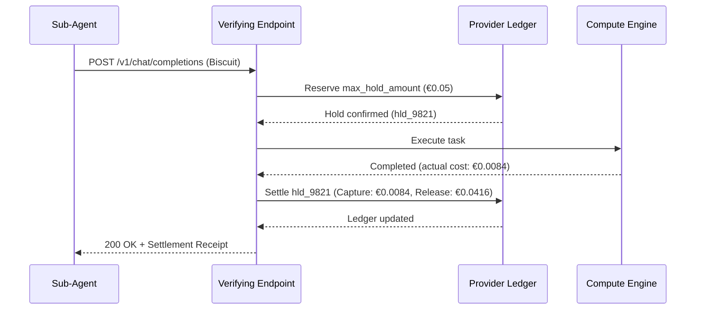
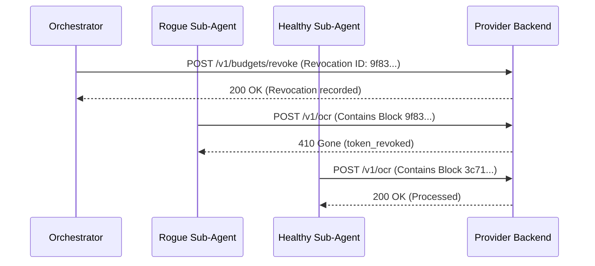

# Architecture: Cryptographic Delegation & Budget Accounting

## 1. Actors

- **Merchant of Record (MoR)**: Processes the upfront fiat payment, manages tax and indirect VAT/sales compliance, and settles funds to the Provider. The MoR operates outside the M2M protocol itself.
- **Provider**: Exposes one or more M2M services. Generates and holds the private root signing keypair ($SK_{root}, PK_{root}$). Verifying endpoints evaluate tokens using $PK_{root}$.
- **Orchestrator**: Client-side primary agent that initiates payment (or acts on behalf of a human principal) and receives the Master Token.
- **Sub-Agents**: Autonomous worker agents spawned by the Orchestrator, each receiving an attenuated, sealed token restricting execution scope and spend.



## 2. Cryptographic Primitive: Biscuit Tokens

Verifying endpoints across a distributed or multi-service architecture must validate access credentials without circular dependencies on a central issuing key. This architecture adopts **Biscuit tokens** [COUPRIE2021], a decentralized authorization scheme based on public-key signatures and Datalog policies.

### 2.1 Contrast with HMAC Macaroons
Classic Macaroons [BIRGISSON2014] (as deployed in L402 [L402]) rely on symmetric HMAC chains. Under that design, verifying a token requires the root secret key. Consequently, every verifying endpoint within a provider's infrastructure must either hold the root secret—expanding the compromise blast radius—or query the issuing service synchronously.

In contrast, Biscuit uses asymmetric public-key cryptography. The Provider signs the root block with a private key ($SK_{root}$), and verifying endpoints (resource servers/gateways) validate the delegation chain using only the public key ($PK_{root}$). Offline attenuation remains cryptographically guaranteed: downstream holders (clients and orchestrators) can append restrictive blocks without knowledge of the private signing keys and without needing to configure or manage public key registries.

### 2.2 Ephemeral Key Chains
Biscuit chains blocks via internal ephemeral keypairs:
- When a block $i$ is appended, the signer generates a new ephemeral keypair ($SK_{i+1}, PK_{i+1}$).
- The signer computes signature $Sig_i$ over the concatenation of the block payload and the new public key $PK_{i+1}$, using the private key $SK_i$ from the preceding block:

$$Sig_i = \text{Sign}(SK_i, Block_i \parallel PK_{i+1})$$

The signature verifies both the integrity of $Block_i$ and the authenticity of $PK_{i+1}$, establishing a cryptographic chain of custody.

### 2.3 Master Token Issuance (The Authority Block)
Upon receiving a confirmed payment from the MoR, the Provider generates the Master Token:
1. **Block 0 (Authority Block)**: Contains the base entitlement and financial correlation identifier (e.g., `checkout_id = "chk_883019"`).
2. **Key Generation**: Provider generates ephemeral keypair ($SK_1, PK_1$).
3. **Signature**: Provider signs $Block_0 \parallel PK_1$ using $SK_{root}$:

$$Sig_0 = \text{Sign}(SK_{root}, Block_0 \parallel PK_1)$$

4. **Payload Delivery**: Delivered to the Orchestrator containing `[Block_0]`, `[PK_1]`, `[Sig_0]`, and active private key $SK_1$. Possession of $SK_1$ authorizes offline attenuation.

## 3. Attenuation & Datalog Semantics

The Orchestrator derives specialized tokens for downstream sub-agents by appending signed attenuation blocks.

### 3.1 Datalog Execution Model: Stateless Checks vs. Stateful Budgets
Biscuit policies are expressed in Datalog [CERI1989]. A `check` evaluates facts carried within the token blocks alongside **ambient facts** injected dynamically by the verifying endpoint for that specific request (e.g., `ambient::request_cost(0.05)`, `ambient::endpoint("/v1/ocr")`).

The Datalog engine operates deterministically and without persistent state across requests. Authorization constraints fall into two distinct operational classes:

#### 1. Stateless Per-Request Caveats (Local Evaluation)
Enforced entirely by the local Datalog engine without database interaction:
- Per-invocation cost ceiling:
  ```datalog
  check if ambient::request_cost($c), $c <= 0.50;
  ```
- Endpoint restriction:
  ```datalog
  check if ambient::endpoint($e), $e == "/v1/ocr";
  ```
- Temporal expiration:
  ```datalog
  check if ambient::time($t), $t <= 1774224000;
  ```

#### 2. Stateful Cumulative Quotas (Ledger Correlation)
A caveat such as `check if ambient::request_cost($c), $c <= 3.00` validates only that the *individual* request does not exceed €3.00. It does not enforce a cumulative ceiling across multiple calls.

To enforce cumulative sub-budgets across an agent swarm:
1. The Orchestrator embeds an identity fact in the attenuation block:
   ```datalog
   fact: sub_agent_id("worker-alpha");
   fact: allocated_budget(3.00);
   ```
2. The verifying endpoint extracts `sub_agent_id` from the verified token and queries the central ledger for the composite key `(checkout_id, sub_agent_id)`.
3. The server ensures that cumulative historical spend plus current request cost does not exceed `allocated_budget`.

## 4. Token Sealing & Proof of Possession

### 4.1 Mandatory Sealing
An unsealed Biscuit contains the active ephemeral private key $SK_N$, permitting further block additions. Before delegating a token to an untrusted or sandboxed sub-agent, the Orchestrator **seals** the token by stripping $SK_N$. Without $SK_N$, appending further blocks is mathematically impossible, while verification remains intact.

### 4.2 Proof of Possession (PoP)
By default, sealed Biscuits are bearer credentials: possession of the token string allows spending from the associated ledger account. In environments with untrusted intermediaries or tools, the Orchestrator binds the token to the sub-agent's asymmetric keypair ($SK_{sub}, PK_{sub}$) using Proof of Possession principles [RFC9449]:
1. **Binding Caveat**: Orchestrator embeds the sub-agent public key:
   ```datalog
   check if ambient::caller_pk($pk), $pk == "hex_encoded_pk_sub";
   ```
2. **Request Signature**: The sub-agent signs request metadata (method, URI, timestamp) with $SK_{sub}$, passed via `extensions.pop_signature`.
3. **Verification**: The endpoint validates the signature and asserts `ambient::caller_pk("hex_encoded_pk_sub")`. Replayed or intercepted tokens fail Datalog evaluation without $SK_{sub}$.

## 5. Chain Verification

Verification proceeds sequentially from $PK_{root}$:
1. Verify $Sig_0$ on $Block_0 \parallel PK_1$ using $PK_{root}$.
2. Verify $Sig_1$ on $Block_1 \parallel PK_2$ using authenticated $PK_1$.
3. Continue to terminal block $N$.
4. Evaluate Datalog caveats against ambient request facts.

## 6. Budget Accounting & Ledger Management

Because attenuation is purely additive, cryptographic verification alone cannot prevent sibling tokens derived from the same root from overdrawing the initial balance. The Provider maintains a stateful ledger indexed by `checkout_id`.

### 6.1 Two-Phase Settlement for Dynamic Costs (Hold / Capture)
For variable-cost workloads (such as LLM generation and streaming pipelines), billing post-execution creates overdraft risks, while static pre-billing is inflexible. The Provider ledger implements an atomic two-phase lifecycle:
1. **Hold (Reservation)**: Prior to dispatching compute, the server places a hold on `max_hold_amount` under `checkout_id`. If `available_balance < max_hold_amount`, the request is rejected immediately (`402 Payment Required`, `budget_insufficient_for_reservation`).
2. **Execution & Metering**: The task executes while monitoring consumption against the ceiling.
3. **Capture & Release**: Upon completion, the server commits `actual_cost` and releases the difference (`max_hold_amount - actual_cost`) back to `available_balance`.



### 6.2 Budget Top-Up
When a balance is depleted, re-issuing new tokens disrupts active agent swarms. The Provider ledger treats `checkout_id` as a persistent credit account:
- Upon receiving a top-up checkout webhook from the MoR, the Provider increments `available_balance` on the existing `checkout_id`.
- Active sub-agents resume operations with their existing, sealed Biscuit tokens. No token re-attenuation or swarm redeployment is required.

### 6.3 Architectural Scope: SME Model & Vertical Partitioning
This architecture focuses on freelancers and small-to-medium enterprises (SMEs) with targeted microservice portfolios:
- **Centralized ACID Ledger**: Distributed consensus algorithms (e.g., Raft, Paxos) are deliberate non-goals. A standard relational or in-memory store with row-level locks provides atomic settlement without distributed consensus overhead.
- **Consortium Verification via Vertical Partitioning**: In multi-entity environments, an issuing entity acts as guarantor and signs Block 0. Partner providers verify tokens using the issuer's public key ($PK_{root}$). Quotas are partitioned vertically (e.g., `endpoint = provider2.example, allocated_budget = €2.00`), allowing partner services to track balances in local databases without real-time cross-provider synchronization.

## 7. Revocation Architecture

Revocation operates at two distinct tiers:

### 7.1 Tier 1: Upstream MoR Master Revocation
Triggered by payment refunds, disputes, or chargebacks reported via MoR webhooks. The Provider marks `checkout_id` as revoked in the ledger. All downstream sub-agent requests under that lineage fail ledger resolution (`410 Gone`, `token_revoked`).

### 7.2 Tier 2: Surgical Sub-Agent Revocation
When an individual sub-agent exhibits anomalous behavior (e.g., recursion loops), the Orchestrator can revoke that specific agent without terminating healthy swarm siblings:
1. **Revocation Identifiers**: Each Biscuit block carries a cryptographic `revocation_id` (SHA-256 hash of block contents and signature).
2. **Management API**: The Orchestrator calls `POST /v1/budgets/revoke`, authenticating with its Master Token and specifying the target block's `revocation_id`.
3. **Enforcement**: Verifying endpoints match presented tokens against the revocation cache. Tokens containing the revoked block return `410 Gone`, while sibling chains remain authorized.



## 8. Cross-References

- **Wire Protocol & X402 Extension**: Concrete HTTP headers, JSON schemas, status codes, and traces are specified in [`03-wire-protocol.md`](./03-wire-protocol.md).
- **Tax & Regulatory Framework**: The EU Voucher Directive legal analysis (SPV vs. MPV) is detailed in [`04-tax-and-legal.md`](./04-tax-and-legal.md).
- **Open Problems**: Known trade-offs and limitations are tracked in [`05-open-problems.md`](./05-open-problems.md).
- **Bibliography**: Complete citations are listed in [`06-references.md`](./06-references.md).
