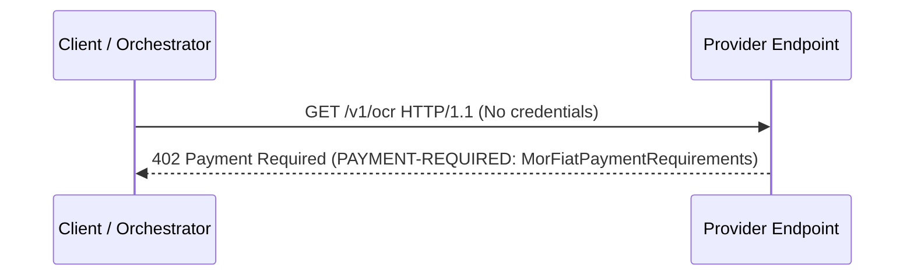
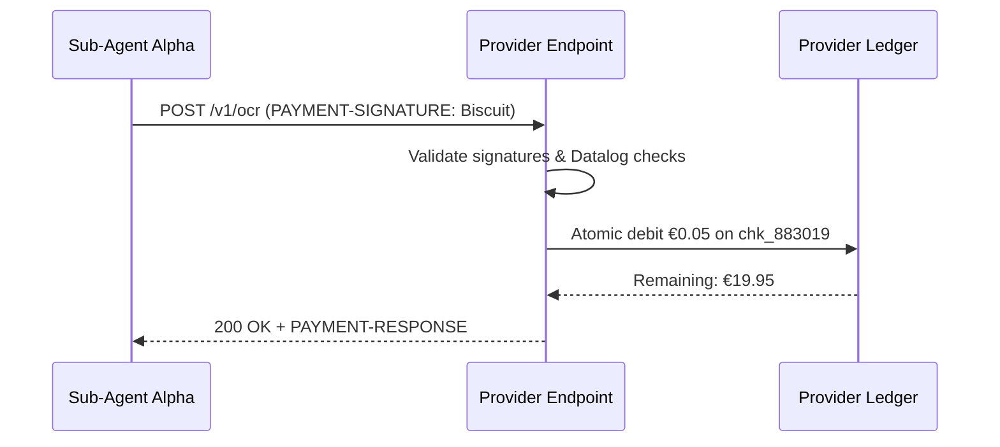
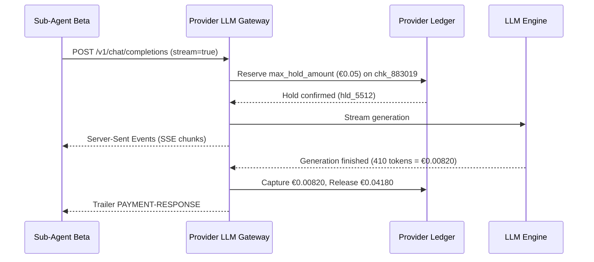
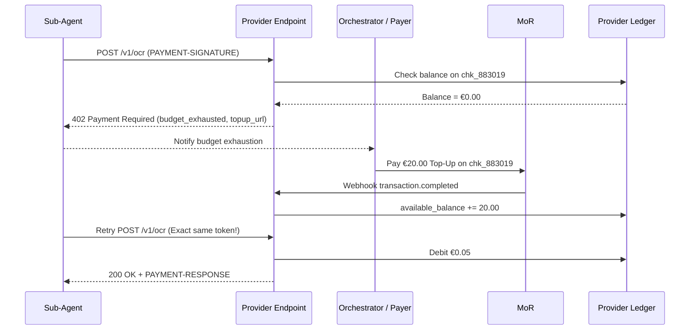
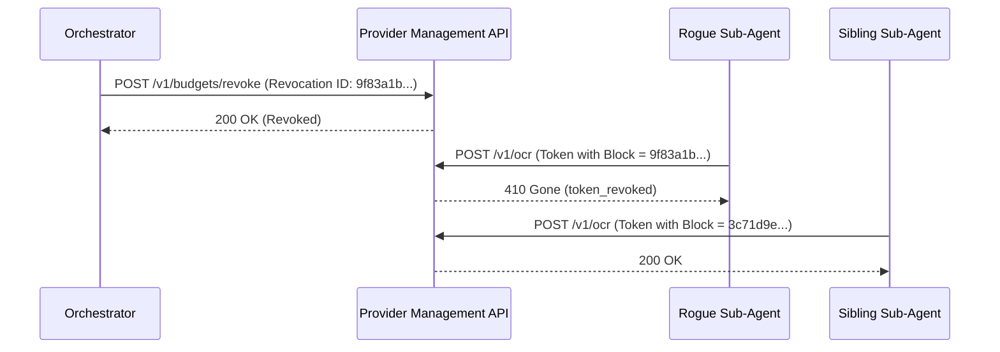

# Wire Protocol & X402 Extension Specification

This document specifies the HTTP wire protocol for **Attenuated Agent Budgets** by extending the X402 (v2) standard [X402] with the `mor-fiat` scheme. It details headers, JSON schemas, status codes, and concrete exchange flows.

## 1. Protocol Architecture & Header Envelopes

The protocol reuses the core challenge-response semantics of X402 v2 [X402] and HTTP status codes defined in RFC 9110 [RFC9110]. All control messages transmitted over HTTP headers are **Base64-encoded JSON**:

| Header | Origin | Payload Type | Semantic Role |
|---|---|---|---|
| `PAYMENT-REQUIRED` | Server $\rightarrow$ Client | `MorFiatPaymentRequirements` | Emitted with HTTP 402; specifies checkout details, pricing model, and supported constraints. |
| `PAYMENT-SIGNATURE` | Client $\rightarrow$ Server | `PaymentPayload` | Attached to requests; carries the sealed Biscuit token and sub-agent metadata. |
| `PAYMENT-RESPONSE` | Server $\rightarrow$ Client | `SettlementResponse` | Emitted upon settlement (or rejection); provides transaction IDs, debited amounts, and balance status. |

In addition to base64 headers, error responses provide a structured `application/json` response body for client-side diagnostics.

## 2. The `mor-fiat` Scheme Specification

The `mor-fiat` scheme adapts X402 to off-chain, Merchant-of-Record fiat transactions. Instead of on-chain wallet addresses and network identifiers, `PaymentRequirements` contains parameters required to complete or correlate a fiat purchase.

### 2.1 JSON Schema (`MorFiatPaymentRequirements`)

The payload inside the base64-encoded `PAYMENT-REQUIRED` header conforms to JSON Schema (Draft 2020-12):

```json
{
  "$schema": "https://json-schema.org/draft/2020-12/schema",
  "title": "MorFiatPaymentRequirements",
  "type": "object",
  "required": [
    "x402Version",
    "scheme",
    "mor",
    "amount",
    "currency",
    "checkout_url",
    "supported_budget_models",
    "supported_checks"
  ],
  "properties": {
    "x402Version": {
      "type": "integer",
      "const": 2,
      "description": "Major version of the X402 protocol."
    },
    "scheme": {
      "type": "string",
      "const": "mor-fiat",
      "description": "Scheme identifier."
    },
    "mor": {
      "type": "string",
      "description": "Designated Merchant of Record processor (e.g., 'paddle', 'stripe-billing')."
    },
    "amount": {
      "type": "string",
      "pattern": "^[0-9]+(\\.[0-9]{2,4})?$",
      "description": "Prepayment amount required to provision or top up the Master Token."
    },
    "currency": {
      "type": "string",
      "pattern": "^[A-Z]{3}$",
      "description": "ISO 4217 three-letter currency code."
    },
    "checkout_url": {
      "type": "string",
      "format": "uri",
      "description": "MoR-hosted checkout URL for payer settlement."
    },
    "supported_budget_models": {
      "type": "array",
      "items": {
        "type": "string",
        "enum": ["fixed-partition", "shared-counter"]
      },
      "minItems": 1,
      "description": "Budget accounting models supported by the provider ledger."
    },
    "supported_checks": {
      "type": "array",
      "items": {
        "type": "string",
        "enum": ["amount", "quota", "endpoint", "expires_at", "sub_agent_id"]
      },
      "minItems": 1,
      "description": "Datalog caveats evaluated by the verifying endpoint."
    },
    "pricing_model": {
      "type": "string",
      "enum": ["fixed", "dynamic"],
      "default": "fixed",
      "description": "Settlement model: static deduction or two-phase hold."
    },
    "max_hold_amount": {
      "type": "string",
      "pattern": "^[0-9]+(\\.[0-9]{2,4})?$",
      "description": "Maximum ceiling reserved on the ledger for dynamic workloads."
    }
  },
  "additionalProperties": false
}
```

## 3. `PAYMENT-SIGNATURE` Encapsulation

When calling protected endpoints, the client encapsulates the attenuated Biscuit token within an X402 v2 `PaymentPayload` envelope:

```json
{
  "x402Version": 2,
  "scheme": "mor-fiat",
  "payload": {
    "token": "<base64-serialized-sealed-biscuit>",
    "sub_agent_id": "worker-alpha"
  },
  "extensions": {
    "pop_public_key": "hex_encoded_pk_sub",
    "pop_signature": "base64_signature",
    "pop_timestamp": 1774224000
  }
}
```

- `x402Version`: Must be integer `2`.
- `scheme`: Must be `"mor-fiat"`.
- `payload.token`: Base64 binary serialization of the Biscuit token. Tokens must be sealed prior to client dispatch.
- `payload.sub_agent_id`: Identifier used by the ledger to correlate cumulative sub-agent quotas.
- `extensions`: Optional bag for Proof of Possession (PoP) parameters [RFC9449] and telemetry.

## 4. HTTP Status Codes & Error Response Matrix

The protocol establishes explicit mappings between validation outcomes, HTTP status codes [RFC9110], and response headers:

| Status Code | Condition | Primary Header | `errorReason` | Error Body `error` |
|---|---|---|---|---|
| `402 Payment Required` | Unauthenticated call (challenge) | `PAYMENT-REQUIRED` | N/A | `payment_required` |
| `402 Payment Required` | Valid token, but ledger balance is zero | `PAYMENT-REQUIRED` + `PAYMENT-RESPONSE` | `budget_exhausted` | `budget_exhausted` |
| `401 Unauthorized` | Invalid cryptographic signature / unknown root | `PAYMENT-RESPONSE` | `invalid_token_signature` | `invalid_token_signature` |
| `403 Forbidden` | Datalog caveat evaluation failure (e.g. endpoint mismatch) | `PAYMENT-RESPONSE` | `policy_check_failed` | `policy_check_failed` |
| `410 Gone` | Token or block identifier is on the Revocation List | `PAYMENT-RESPONSE` | `token_revoked` | `token_revoked` |
| `200 OK` | Signature valid, caveats pass, budget debited | `PAYMENT-RESPONSE` | N/A (`success: true`) | Application payload |

## 5. End-to-End Protocol Exchange Flows

### 5.1 Flow 1: Initial Discovery & 402 Challenge

An unprovisioned client requests a protected resource without payment credentials.



#### Request
```http
GET /v1/ocr HTTP/1.1
Host: api.provider.example
Accept: application/json
```

#### Response
```http
HTTP/1.1 402 Payment Required
Content-Type: application/json; charset=utf-8
PAYMENT-REQUIRED: eyJ4NDAyVmVyc2lvbiI6Miwic2NoZW1lIjoibW9yLWZpYXQiLCJtb3IiOiJwYWRkbGUiLCJhbW91bnQiOiIyMC4wMCIsImN1cnJlbmN5IjoiRVVSIiwiY2hlY2tvdXRfdXJsIjoiaHR0cHM6Ly9hcGkucHJvdmlkZXIuZXhhbXBsZS9jaGVja291dC9jaGtfODgzMDE5Iiwic3VwcG9ydGVkX2J1ZGdldF9tb2RlbHMiOlsic2hhcmVkLWNvdW50ZXIiLCJmaXhlZC1wYXJ0aXRpb24iXSwic3VwcG9ydGVkX2NoZWNrcyI6WyJhbW91bnQiLCJxdW90YSIsImVuZHBvaW50IiwiZXhwaXJlc19hdCIsInN1Yl9hZ2VudF9pZCJdLCJwcmljaW5nX21vZGVsIjoiZml4ZWQifQ==

{
  "x402Version": 2,
  "error": "payment_required",
  "message": "Payment or valid budget token required.",
  "requirements": {
    "scheme": "mor-fiat",
    "mor": "paddle",
    "amount": "20.00",
    "currency": "EUR",
    "checkout_url": "https://api.provider.example/checkout/chk_883019",
    "supported_budget_models": ["shared-counter", "fixed-partition"],
    "supported_checks": ["amount", "quota", "endpoint", "expires_at", "sub_agent_id"],
    "pricing_model": "fixed"
  }
}
```

### 5.2 Flow 2: Token Provisioning & Attenuation

1. **Settlement**: The human/orchestrator completes the checkout via `checkout_url`.
2. **Issuance**: The MoR issues a `transaction.completed` webhook to the Provider backend, which mints the Master Token with Block 0:
   ```datalog
   fact: checkout_id("chk_883019");
   fact: total_budget(20.00);
   ```
3. **Attenuation & Sealing**: The Orchestrator appends Block 1 offline and strips the active private key:
   ```datalog
   check if ambient::endpoint($e), $e == "/v1/ocr";
   check if ambient::request_cost($c), $c <= 0.50;
   fact: sub_agent_id("worker-alpha");
   ```

### 5.3 Flow 3: Steady-State Invocation (Fixed-Cost API)

Sub-Agent Alpha executes a request using its sealed, attenuated Biscuit.



#### Request
```http
POST /v1/ocr HTTP/1.1
Host: api.provider.example
Content-Type: application/json
PAYMENT-SIGNATURE: eyJ4NDAyVmVyc2lvbiI6Miwic2NoZW1lIjoibW9yLWZpYXQiLCJwYXlsb2FkIjp7InRva2VuIjoiQ2xBQ0VpMEdDaXFnZFhSc2FYTmxjeXdn...IsInN1Yl9hZ2VudF9pZCI6Indvcmtlci1hbHBoYSJ9LCJleHRlbnNpb25zIjp7fX0=

{
  "image_url": "https://data.example/invoice_scan_01.png",
  "language": "en"
}
```

#### Response
```http
HTTP/1.1 200 OK
Content-Type: application/json; charset=utf-8
PAYMENT-RESPONSE: eyJzdWNjZXNzIjp0cnVlLCJ0cmFuc2FjdGlvbiI6InR4X2xlZGdlcl84ODMwMTlfMDEwIiwibmV0d29yayI6Im1vci1maWF0IiwiYW1vdW50IjoiMC4wNSIsInBheWVyIjoiY2hrXzg4MzAxOSIsImV4dGVuc2lvbnMiOnsicmVtYWluaW5nX2J1ZGdldCI6IjE5Ljk1IiwiY3VycmVuY3kiOiJFVVIifX0=

{
  "text": "Invoice #49281\nDate: 2026-09-22\nTotal Due: €120.50",
  "confidence": 0.985
}
```

### 5.4 Flow 4: Two-Phase Reservation for Dynamic / LLM Costs

For streaming or variable-cost workloads, the Provider places an atomic reservation prior to execution.



#### Request
```http
POST /v1/chat/completions HTTP/1.1
Host: api.provider.example
Content-Type: application/json
Accept: text/event-stream
PAYMENT-SIGNATURE: eyJ4NDAyVmVyc2lvbiI6Miwic2NoZW1lIjoibW9yLWZpYXQiLCJwYXlsb2FkIjp7InRva2VuIjoiQ2xBQ0VpMEdDaXFnZFhSc2FYTmxjeXdn...IsInN1Yl9hZ2VudF9pZCI6Indvcmtlci1iZXRhIn0sImV4dGVuc2lvbnMiOnt9fQ==

{
  "model": "mistral-large",
  "messages": [{"role": "user", "content": "Analyze balance sheet..."}],
  "stream": true,
  "max_tokens": 1000
}
```

#### Response (SSE Stream with Trailer Header)
```http
HTTP/1.1 200 OK
Content-Type: text/event-stream; charset=utf-8
Transfer-Encoding: chunked
Connection: keep-alive
Trailer: PAYMENT-RESPONSE

data: {"choices": [{"delta": {"content": "Based on the"}}]}

data: {"choices": [{"delta": {"content": " balance sheet..."}}]}

data: [DONE]

PAYMENT-RESPONSE: eyJzdWNjZXNzIjp0cnVlLCJ0cmFuc2FjdGlvbiI6InR4X2NhcF85ODIxMCIsIm5ldHdvcmsiOiJtb3ItZmlhdCIsImFtb3VudCI6IjAuMDA4MjAiLCJwYXllciI6ImNoa184ODMwMTkiLCJleHRlbnNpb25zIjp7ImhlbGRfYW1vdW50IjoiMC4wNTAwMCIsImNhcHR1cmVkX2Ftb3VudCI6IjAuMDA4MjAiLCJyZWxlYXNlZF9hbW91bnQiOiIwLjA0MTgwIiwicmVtYWluaW5nX2F2YWlsYWJsZV9idWRnZXQiOiIxOS45NDE4MCIsImN1cnJlbmN5IjoiRVVSIn19
```

### 5.5 Flow 5: Budget Exhaustion & Top-Up Continuity

When the ledger balance under `checkout_id` reaches zero, requests are rejected with `402 Payment Required`. Re-crediting the existing `checkout_id` restores service without re-issuing tokens.



#### Exhaustion Response
```http
HTTP/1.1 402 Payment Required
Content-Type: application/json; charset=utf-8
PAYMENT-REQUIRED: eyJ4NDAyVmVyc2lvbiI6Miwic2NoZW1lIjoibW9yLWZpYXQiLCJtb3IiOiJwYWRkbGUiLCJhbW91bnQiOiIyMC4wMCIsImN1cnJlbmN5IjoiRVVSIiwiY2hlY2tvdXRfdXJsIjoiaHR0cHM6Ly9hcGkucHJvdmlkZXIuZXhhbXBsZS9jaGVja291dC90b3B1cD9pZD1jaGtfODgzMDE5Iiwic3VwcG9ydGVkX2J1ZGdldF9tb2RlbHMiOlsic2hhcmVkLWNvdW50ZXIiXX0=
PAYMENT-RESPONSE: eyJzdWNjZXNzIjpmYWxzZSwiZXJyb3JSZWFzb24iOiJidWRnZXRfZXhoYXVzdGVkIiwidHJhbnNhY3Rpb24iOiIiLCJuZXR3b3JrIjoibW9yLWZpYXQifQ==

{
  "x402Version": 2,
  "error": "budget_exhausted",
  "message": "The allocated budget for this token lineage has been exhausted.",
  "details": {
    "checkout_id": "chk_883019",
    "remaining_budget": "0.00",
    "currency": "EUR",
    "topup_url": "https://api.provider.example/checkout/topup?id=chk_883019"
  }
}
```

### 5.6 Flow 6: Surgical Revocation

The Orchestrator revokes an anomalous sub-agent's block revocation ID via the management API.



#### Revocation Request
```http
POST /v1/budgets/revoke HTTP/1.1
Host: api.provider.example
Content-Type: application/json
PAYMENT-SIGNATURE: eyJ4NDAyVmVyc2lvbiI6Miwic2NoZW1lIjoibW9yLWZpYXQiLCJwYXlsb2FkIjp7InRva2VuIjoiPE1BU1RFUl9UT0tFTj4ifX0=

{
  "checkout_id": "chk_883019",
  "sub_agent_id": "worker-rogue-01",
  "revocation_id": "9f83a1b4c278e901fa5412bced88201948ef11029481bcde5819401828471201",
  "reason": "loop_detected"
}
```

#### Rejection of Revoked Sub-Agent
```http
HTTP/1.1 410 Gone
Content-Type: application/json
PAYMENT-RESPONSE: eyJzdWNjZXNzIjpmYWxzZSwiZXJyb3JSZWFzb24iOiJ0b2tlbl9yZXZva2VkIiwidHJhbnNhY3Rpb24iOiIiLCJuZXR3b3JrIjoibW9yLWZpYXQifQ==

{
  "x402Version": 2,
  "error": "token_revoked",
  "message": "The presented token or block has been revoked.",
  "details": {
    "checkout_id": "chk_883019",
    "revoked_block_id": "9f83a1b4c278e901fa5412bced88201948ef11029481bcde5819401828471201"
  }
}
```

### 5.7 Flow 7: Policy Violation (403 Forbidden)

If a token violates an embedded Datalog caveat (e.g. attempting to access `/v1/admin` when restricted to `/v1/ocr`), the server returns `403 Forbidden`. Payment status is not defective, hence `402` must not be used.

#### Request
```http
POST /v1/admin/purge HTTP/1.1
Host: api.provider.example
PAYMENT-SIGNATURE: eyJ4NDAyVmVyc2lvbiI6Miwic2NoZW1lIjoibW9yLWZpYXQiLCJwYXlsb2FkIjp7InRva2VuIjoiQ2xBQ0VpMEdDaXFnZFhSc2FYTmxjeXdn...
```

#### Response
```http
HTTP/1.1 403 Forbidden
Content-Type: application/json; charset=utf-8
PAYMENT-RESPONSE: eyJzdWNjZXNzIjpmYWxzZSwiZXJyb3JSZWFzb24iOiJwb2xpY3lfY2hlY2tfZmFpbGVkIiwidHJhbnNhY3Rpb24iOiIiLCJuZXR3b3JrIjoibW9yLWZpYXQifQ==

{
  "x402Version": 2,
  "error": "policy_check_failed",
  "message": "Biscuit verification failed: Datalog caveat unsatisfied.",
  "details": {
    "failed_check": "check if ambient::endpoint($e), $e == \"/v1/ocr\"",
    "ambient_facts": {
      "requested_endpoint": "/v1/admin/purge",
      "caller_method": "POST"
    }
  }
}
```
