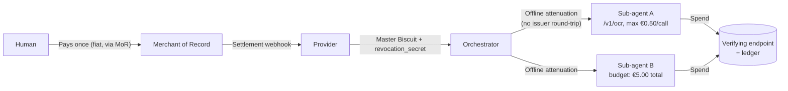

# Attenuated Agent Budgets

Cryptographic budget delegation (Biscuits) for multi-agent M2M payments via Merchant of Record fiat settlement.

> **TL;DR**: Turn one fiat payment into a revocable, offline-splittable spending budget for a swarm of autonomous agents — no crypto, no wallets, no per-call settlement.

## The Problem

Current M2M payment protocols (such as L402, X402, and MPP) generally assume crypto-native or per-request settlement. For freelancers and SMEs under several European tax regimes, that's a dealbreaker: every crypto-denominated microtransaction can be a taxable disposal event, with no de minimis exemption. Ten thousand automated €0.002 calls can mean ten thousand reportable events.

This project asks a narrower question: once a human has paid once, in fiat, through a Merchant of Record — how do you let an orchestrator agent split that budget into independently revocable, cryptographically enforced sub-budgets for its worker agents, entirely offline, without touching crypto rails?

## How it works



One signed [Biscuit token](https://www.biscuitsec.org/) carries the budget. The orchestrator can fork it into as many scoped, capped, sealed sub-tokens as it needs — each one independently revocable — without ever calling back to the issuer. A stateful ledger enforces the cumulative ceiling and handles two-phase hold/capture for variable-cost workloads (LLM generation, streaming, etc.).

Full details:
- Cryptographic architecture and Datalog semantics in [`02-architecture.md`](./02-architecture.md)
- Wire protocol specification in [`03-wire-protocol.md`](./03-wire-protocol.md)
- EU voucher and tax analysis in [`04-tax-and-legal.md`](./04-tax-and-legal.md)

## Status

This is a specification and reference implementation, not a production system. The cryptographic architecture, X402 wire protocol, EU tax analysis (SPV classification), and a runnable Python reference implementation are complete and tested.

Known gaps and trade-offs — ledger contention under concurrent swarms, orphaned holds, chargeback exposure, revocation DoS vectors — are documented honestly in [`05-open-problems.md`](./05-open-problems.md) rather than glossed over. If you're evaluating this for production use, start there.

## Contents

| File | Description |
|---|---|
| [`00-abstract.md`](./00-abstract.md) | Abstract and problem framing |
| [`01-landscape.md`](./01-landscape.md) | Comparative landscape of M2M payment and discovery protocols (L402, X402, MPP, MoR platforms) |
| [`02-architecture.md`](./02-architecture.md) | Biscuit authorization architecture, Datalog semantics, sealing, and state delegation |
| [`03-wire-protocol.md`](./03-wire-protocol.md) | X402 wire protocol, JSON Schemas, HTTP status code matrix, and concrete wire exchange traces |
| [`04-tax-and-legal.md`](./04-tax-and-legal.md) | Legal disclaimer, EU Voucher Directive analysis (SPV vs. MPV), and tax neutrality |
| [`05-open-problems.md`](./05-open-problems.md) | Technical limitations, concurrency bottlenecks, edge synchronization, and open questions |
| [`06-references.md`](./06-references.md) | Academic, industry standard, and statutory references |
| [`examples/`](./examples/) | Minimal runnable reference implementation (issuance, offline attenuation, hold/capture, verification) |

## Running the Reference Demo

A self-contained Python reference implementation demonstrating all protocol phases (issuance, offline attenuation, fixed-cost calls, dynamic two-phase hold/capture, budget top-up, and surgical revocation) is available in [`examples/`](./examples/):

```bash
cd examples
pip install -r requirements.txt
python3 demo.py
```

Runs in seconds, no external services required — it simulates the MoR webhook, provider, and ledger in-process. Expect output like:

```text
>> STEP 7: Surgical Revocation of Rogue Sub-Agent
[*] Orchestrator identifies compromised agent: agent_search_01
[*] Target Block Revocation ID: f76bbf0bc33026b8af04ed902bce04fe9...
[-] Test 7A: Rogue entity attempts revocation with invalid management secret...
    HTTP Status: 401 (Expected 401)
[+] Test 7B: Orchestrator executes revocation via management secret...
    HTTP Status: 200 (Expected 200)
[-] Attempting call with revoked agent_search_01:
    HTTP Status: 410 (Expected 410)
[+] Verifying unaffected agent agent_synth_02:
    HTTP Status: 200
>> DEMO COMPLETED SUCCESSFULLY: All 7 architectural phases verified.
```

## FAQ

**Why not just use Stripe metered billing / a plain API key with a quota?**  
Because the quota then has to live in one central place the orchestrator calls on every spend decision. Biscuit lets the orchestrator carve out and hand off sub-budgets offline, to agents it doesn't fully trust, with no round-trip to the issuer and no shared secret — only the verifying endpoint needs the public key.

**Why not just use X402 / L402 as-is?**  
They are built for crypto-native settlement. This proposal is not a replacement — it is a fiat on-ramp for the same capability delegation problem, aimed at the EU freelancer and SME case where per-call crypto settlement creates unacceptable tax and reporting liabilities.

**Is this audited / production-ready?**  
No. It is a specification with a working reference implementation, published to explore the design space and gather feedback. See [`05-open-problems.md`](./05-open-problems.md) for known limitations and open questions.

## License

This repository uses a dual license:
- **Text and documentation**: [CC-BY-4.0](./LICENSE)
- **Code examples**: [MIT](./examples/LICENSE)

## About the Author / Get in touch

**Marco Celeri** is a Senior Software Architect and AI Solution Architect with 15+ years of experience designing and delivering enterprise distributed systems. Formerly coordinator of the AI Lab at Ex Machina (Switzerland), he currently operates as an independent consultant specializing in on-premise AI/LLM architectures, RAG, and autonomous agent systems.

If you are working on agent payments, budget delegation, or M2M infrastructure, feel free to open an issue or connect on [LinkedIn](https://www.linkedin.com/in/marco-celeri-61730b55).
